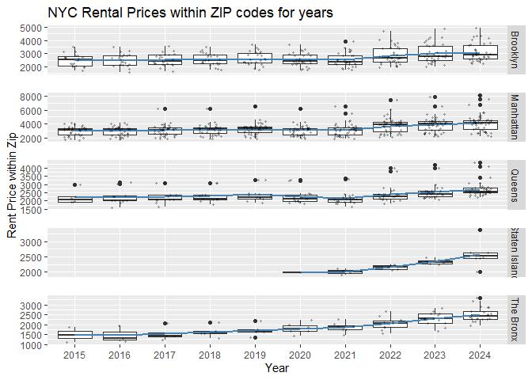
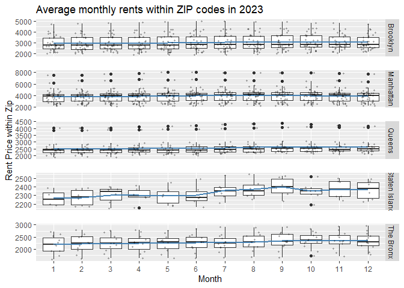
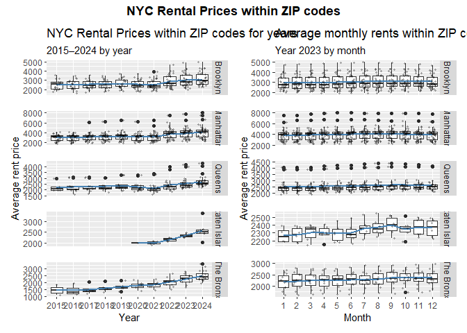

P8105_HW3_rs4788
================
Ruhui Shen
2025-10-12

``` r
library(tidyverse)
```

    ## ── Attaching core tidyverse packages ──────────────────────── tidyverse 2.0.0 ──
    ## ✔ dplyr     1.1.4     ✔ readr     2.1.5
    ## ✔ forcats   1.0.0     ✔ stringr   1.5.1
    ## ✔ ggplot2   3.5.2     ✔ tibble    3.3.0
    ## ✔ lubridate 1.9.4     ✔ tidyr     1.3.1
    ## ✔ purrr     1.1.0     
    ## ── Conflicts ────────────────────────────────────────── tidyverse_conflicts() ──
    ## ✖ dplyr::filter() masks stats::filter()
    ## ✖ dplyr::lag()    masks stats::lag()
    ## ℹ Use the conflicted package (<http://conflicted.r-lib.org/>) to force all conflicts to become errors

``` r
library(viridis) 
```

    ## Loading required package: viridisLite

``` r
library(tidyr)
library(janitor)
```

    ## 
    ## Attaching package: 'janitor'
    ## 
    ## The following objects are masked from 'package:stats':
    ## 
    ##     chisq.test, fisher.test

``` r
library(patchwork)
library(ggplot2)
library(dplyr)
```

# Problem 1

### First load the data:

``` r
library(p8105.datasets)
data("instacart")
glimpse(instacart)
```

    ## Rows: 1,384,617
    ## Columns: 15
    ## $ order_id               <int> 1, 1, 1, 1, 1, 1, 1, 1, 36, 36, 36, 36, 36, 36,…
    ## $ product_id             <int> 49302, 11109, 10246, 49683, 43633, 13176, 47209…
    ## $ add_to_cart_order      <int> 1, 2, 3, 4, 5, 6, 7, 8, 1, 2, 3, 4, 5, 6, 7, 8,…
    ## $ reordered              <int> 1, 1, 0, 0, 1, 0, 0, 1, 0, 1, 0, 1, 1, 1, 1, 1,…
    ## $ user_id                <int> 112108, 112108, 112108, 112108, 112108, 112108,…
    ## $ eval_set               <chr> "train", "train", "train", "train", "train", "t…
    ## $ order_number           <int> 4, 4, 4, 4, 4, 4, 4, 4, 23, 23, 23, 23, 23, 23,…
    ## $ order_dow              <int> 4, 4, 4, 4, 4, 4, 4, 4, 6, 6, 6, 6, 6, 6, 6, 6,…
    ## $ order_hour_of_day      <int> 10, 10, 10, 10, 10, 10, 10, 10, 18, 18, 18, 18,…
    ## $ days_since_prior_order <int> 9, 9, 9, 9, 9, 9, 9, 9, 30, 30, 30, 30, 30, 30,…
    ## $ product_name           <chr> "Bulgarian Yogurt", "Organic 4% Milk Fat Whole …
    ## $ aisle_id               <int> 120, 108, 83, 83, 95, 24, 24, 21, 2, 115, 53, 1…
    ## $ department_id          <int> 16, 16, 4, 4, 15, 4, 4, 16, 16, 7, 16, 4, 16, 2…
    ## $ aisle                  <chr> "yogurt", "other creams cheeses", "fresh vegeta…
    ## $ department             <chr> "dairy eggs", "dairy eggs", "produce", "produce…

### Take a look at the data:

``` r
instacart_summary =
  instacart %>%
  summarise(
    n_obs = n(),
    n_vars = ncol(.),
    n_users = n_distinct(user_id),
    n_orders = n_distinct(order_id),
    n_products = n_distinct(product_id),
    n_aisles = n_distinct(aisle),
    n_departments = n_distinct(department)
  )

instacart_summary
```

    ## # A tibble: 1 × 7
    ##     n_obs n_vars n_users n_orders n_products n_aisles n_departments
    ##     <int>  <int>   <int>    <int>      <int>    <int>         <int>
    ## 1 1384617     15  131209   131209      39123      134            21

This dataset records orders and products information from the Instacart
platform, describing items within specific orders. It contains 1,384,617
observations across 15 variables, covering 131,209 users and 131,209
orders. The dataset includes 39,123 distinct products distributed across
134 aisles and 21 departments.

### Let’s make more detailed description:

#### aisles_items:

``` r
aisle_counts =
  instacart %>%
  count(aisle, name = "n_items") %>%
  arrange(desc(n_items))
aisle_counts
```

    ## # A tibble: 134 × 2
    ##    aisle                         n_items
    ##    <chr>                           <int>
    ##  1 fresh vegetables               150609
    ##  2 fresh fruits                   150473
    ##  3 packaged vegetables fruits      78493
    ##  4 yogurt                          55240
    ##  5 packaged cheese                 41699
    ##  6 water seltzer sparkling water   36617
    ##  7 milk                            32644
    ##  8 chips pretzels                  31269
    ##  9 soy lactosefree                 26240
    ## 10 bread                           23635
    ## # ℹ 124 more rows

``` r
num_aisle = n_distinct(aisle_counts$aisle)
print(num_aisle)
```

    ## [1] 134

There are 134 aisles. In terms of order times, fresh vegetables and
fresh fruits are much higher than other aisles, with packaged vegetables
and fruits ranking third. This demonstrates the high demand for fruits
and vegetables, which are essential daily necessities.

#### Plot for aisle & items_number:

``` r
aisle_plot_data =
  aisle_counts %>%
  filter(n_items > 10000) %>%
  mutate(aisle = forcats::fct_reorder(aisle, n_items))

aisle_plot =
  ggplot(aisle_plot_data, aes(x = aisle, y = n_items)) +
  geom_col(fill = "steelblue") +
  coord_flip(clip = "off") +
  geom_text(aes(label = scales::comma(n_items)),
            hjust = -0.1, size = 2.5) +
  labs(
    title = "Number of items ordered by aisle (> 10,000 only)",
    x = "Aisle",
    y = "Number of items") +
  theme_minimal() +
  theme(plot.margin = margin(5.5, 60, 5.5, 5.5))
aisle_plot
```

<!-- -->

#### Popular items in some aisles:

``` r
target_aisles = c("baking ingredients", "dog food care", "packaged vegetables fruits")

most_popular =
  instacart %>%
  filter(aisle %in% target_aisles) %>%
  group_by(aisle, product_name) %>%
  summarise(n = n(), .groups = "drop_last") %>%
  arrange(desc(n)) %>%
  group_by(aisle) %>%
  slice_max(order_by = n, n = 3, with_ties = FALSE) %>%
  mutate(rank = row_number()) %>%  
  ungroup() %>%
  pivot_wider(
    id_cols   = aisle,
    names_from  = rank,
    values_from = c(product_name, n))

most_popular %>%
  knitr::kable(caption = "The three most popular items in the aisles")
```

| aisle | product_name_1 | product_name_2 | product_name_3 | n_1 | n_2 | n_3 |
|:---|:---|:---|:---|---:|---:|---:|
| baking ingredients | Light Brown Sugar | Pure Baking Soda | Cane Sugar | 499 | 387 | 336 |
| dog food care | Snack Sticks Chicken & Rice Recipe Dog Treats | Organix Chicken & Brown Rice Recipe | Small Dog Biscuits | 30 | 28 | 26 |
| packaged vegetables fruits | Organic Baby Spinach | Organic Raspberries | Organic Blueberries | 9784 | 5546 | 4966 |

The three most popular items in the aisles

#### Mean order hour during a week:

``` r
dow_labs = c("Sun","Mon","Tue","Wed","Thu","Fri","Sat")

mean_hour_day=
  instacart %>%
  filter(product_name %in% c("Pink Lady Apples", "Coffee Ice Cream")) %>%
  mutate(order_dow = factor(order_dow, levels = 0:6, labels = dow_labs)) %>%
  group_by(product_name, order_dow) %>%
  summarise(mean_hour = mean(order_hour_of_day), .groups = "drop") %>%
  pivot_wider(
    names_from = order_dow, 
    values_from = mean_hour
  )

mean_hour_day %>%
  knitr::kable(digits = 1, caption = "Mean order hour on each day of the week")
```

| product_name     |  Sun |  Mon |  Tue |  Wed |  Thu |  Fri |  Sat |
|:-----------------|-----:|-----:|-----:|-----:|-----:|-----:|-----:|
| Coffee Ice Cream | 13.8 | 14.3 | 15.4 | 15.3 | 15.2 | 12.3 | 13.8 |
| Pink Lady Apples | 13.4 | 11.4 | 11.7 | 14.2 | 11.6 | 12.8 | 11.9 |

Mean order hour on each day of the week

# Problem 2

### Import, clean, and tidy data:

``` r
zip_code =
  read_csv("./data/zillow_data/Zip Codes.csv") %>%
  janitor::clean_names()
```

    ## Rows: 322 Columns: 7
    ## ── Column specification ────────────────────────────────────────────────────────
    ## Delimiter: ","
    ## chr (4): County, County Code, File Date, Neighborhood
    ## dbl (3): State FIPS, County FIPS, ZipCode
    ## 
    ## ℹ Use `spec()` to retrieve the full column specification for this data.
    ## ℹ Specify the column types or set `show_col_types = FALSE` to quiet this message.

``` r
zip_zori =
  read_csv("./data/zillow_data/Zip_zori_uc_sfrcondomfr_sm_month_NYC.csv") %>%
  janitor::clean_names() %>%
  mutate(region_name = as.character(region_name))
```

    ## Rows: 149 Columns: 125
    ## ── Column specification ────────────────────────────────────────────────────────
    ## Delimiter: ","
    ## chr   (6): RegionType, StateName, State, City, Metro, CountyName
    ## dbl (119): RegionID, SizeRank, RegionName, 2015-01-31, 2015-02-28, 2015-03-3...
    ## 
    ## ℹ Use `spec()` to retrieve the full column specification for this data.
    ## ℹ Specify the column types or set `show_col_types = FALSE` to quiet this message.

``` r
zori_long =
  zip_zori %>%
  rename(zip_code = region_name) %>%        
  pivot_longer(
    cols = matches("^x?\\d{4}[_-]\\d{2}([_-]\\d{2})?$"), 
    names_to  = "date_raw",
    values_to = "rent"
  ) %>%
  mutate(
    date_raw = as.character(date_raw),
    date_raw = str_remove(date_raw, "^x"),
    date_raw = str_replace_all(date_raw, "_", "-"),
    date_raw = if_else(str_detect(date_raw, "^\\d{4}-\\d{2}$"),
                       paste0(date_raw, "-01"), date_raw),
    date = ymd(date_raw)
  ) %>%
  select(zip_code, date, rent) %>%
  drop_na(rent)
```

``` r
zip_borough =
  zip_code %>%
  transmute(
    zip_code = as.character(zip_code),
    county   = str_to_lower(county) |> 
               str_trim() |>
               str_replace("\\s+county$", "")) %>%
  mutate(
    borough = case_when(
      county == "new york"  ~ "Manhattan",
      county == "kings"      ~ "Brooklyn",
      county == "queens"     ~ "Queens",
      county == "bronx"      ~ "The Bronx",
      county == "richmond"   ~ "Staten Island",
      TRUE ~ NA_character_
    )) %>%
  select(zip_code, borough)
```

``` r
zori <-
  zori_long %>%
  left_join(zip_borough, by = "zip_code",relationship = "many-to-many") %>%
  drop_na(borough)
zori
```

    ## # A tibble: 10,677 × 4
    ##    zip_code date        rent borough
    ##    <chr>    <date>     <dbl> <chr>  
    ##  1 11368    2024-07-31 2322. Queens 
    ##  2 11368    2024-08-31 2282. Queens 
    ##  3 11385    2016-05-31 2266. Queens 
    ##  4 11385    2016-06-30 2292. Queens 
    ##  5 11385    2016-07-31 2321. Queens 
    ##  6 11385    2016-08-31 2343. Queens 
    ##  7 11385    2016-09-30 2337. Queens 
    ##  8 11385    2016-10-31 2345. Queens 
    ##  9 11385    2016-11-30 2320. Queens 
    ## 10 11385    2016-12-31 2326. Queens 
    ## # ℹ 10,667 more rows

### Answer some questions:

#### Zip code count:

``` r
zip_count =
  zori_long %>%
  filter(date >= ymd("2015-01-01"), date <= ymd("2024-08-31")) %>%  
  group_by(zip_code) %>%
  summarise(n_months = n_distinct(date), .groups = "drop") %>%
  summarise(zips_116 = sum(n_months == 116),
            zips_lt10 = sum(n_months < 10))
zip_count
```

    ## # A tibble: 1 × 2
    ##   zips_116 zips_lt10
    ##      <int>     <int>
    ## 1       48        26

Between January 2015 and August 2024, 48 ZIP codes are observed 116
times, while 26 ZIP codes are observed fewer than 10 times. This is
because rarely observed ZIPs are typically boundary or newly created or
retired ZIP codes, areas with very sparse listings, so they don’t
receive a ZORI every month. However, well-covered ZIPs have consistent
monthly data across the whole window.

#### Average rental price in brough and year:

``` r
avg_price <-
  zori %>%
  group_by(borough, year = year(date)) %>%
  summarise(avg_rent = mean(rent, na.rm = TRUE), .groups = "drop") %>%
  mutate(borough = fct_relevel(borough, "Manhattan","Brooklyn","Queens","The Bronx","Staten Island")) %>%
  arrange(borough, year) %>%
  pivot_wider(names_from = year, values_from = avg_rent) %>%
  knitr::kable(digits = 0, caption = "Average rental price in each borough and year")

avg_price
```

| borough       | 2015 | 2016 | 2017 | 2018 | 2019 | 2020 | 2021 | 2022 | 2023 | 2024 |
|:--------------|-----:|-----:|-----:|-----:|-----:|-----:|-----:|-----:|-----:|-----:|
| Manhattan     | 3006 | 3015 | 3109 | 3160 | 3285 | 3091 | 3124 | 3753 | 3908 | 4053 |
| Brooklyn      | 2493 | 2520 | 2546 | 2547 | 2631 | 2555 | 2550 | 2868 | 3015 | 3126 |
| Queens        | 2215 | 2272 | 2263 | 2292 | 2388 | 2316 | 2211 | 2406 | 2562 | 2694 |
| The Bronx     | 1760 | 1520 | 1544 | 1639 | 1706 | 1811 | 1858 | 2054 | 2285 | 2497 |
| Staten Island |   NA |   NA |   NA |   NA |   NA | 1978 | 2045 | 2147 | 2333 | 2536 |

Average rental price in each borough and year

Looking at the annual average rent data, according to brought, the rent
in Manhattan has been the highest over the years, followed by Brooklyn,
Queens, and The Bronx and Staten Island have the lowest rents. From the
timeline perspective, the rent in New York continued to rise from 2015
to 2019. It then entered a stagnation period or even slightly declined
in 2020 and 2021. However, it rebounded in 2022 and has been
continuously rising ever since.

#### Plot for rental price within ZIP code：

``` r
zip_year =
  zori %>%
  group_by(borough, zip_code, year = year(date)) %>%
  summarise(rent_year_zip = mean(rent, na.rm = TRUE), .groups = "drop")

borough_year =
  zip_year %>%
  group_by(borough, year) %>%
  summarise(mean_rent = mean(rent_year_zip), .groups = "drop")

price_zip_plot =
  ggplot(zip_year, aes(x = factor(year), y = rent_year_zip)) +
  geom_boxplot() +
  geom_line(
    data = borough_year,
    aes(y = mean_rent, group = 1),
    linewidth = 0.8, color = "steelblue") +
  geom_jitter(width = 0.25, height = 0, alpha = 0.25, size = 0.6) +
  facet_grid(borough ~ ., scales = "free_y") +  
  labs(title = "NYC Rental Prices within ZIP codes for years", x= "Year", y = "Rent Price within Zip") +
  theme(panel.spacing.y = unit(1.2, "lines")) 

price_zip_plot
```

<!-- -->
Rental prices vary across boroughs, with annual rental changes
consistent with the findings from the previous question. Additionally,
rental prices in Brooklyn and Manhattan exhibit a broader distribution
within zip codes.

#### Plot for rental price in 2023：

``` r
rent_2023 =
  zori %>%
  filter(year(date) == 2023) %>%
  mutate(mon_num = month(date),
         mon_f   = factor(mon_num, levels = 1:12, labels = 1:12)) %>%
  group_by(borough, zip_code, mon_f) %>%
  summarise(avg_rent = mean(rent, na.rm = TRUE), .groups = "drop")


borough_month =
  rent_2023 %>%
  group_by(borough, mon_f) %>%
  summarise(mean_rent = mean(avg_rent), .groups = "drop")

price_zip_2023 =
  ggplot(rent_2023, aes(x = mon_f, y = avg_rent)) +
  geom_boxplot() +
  geom_line(data = borough_month,
            aes(y = mean_rent, group = 1),
            linewidth = 0.8, color = "steelblue") +
  geom_jitter(width = 0.25, height = 0, alpha = 0.25, size = 0.6) +
  facet_grid(borough ~ ., scales = "free_y") +
  labs(title = "Average monthly rents within ZIP codes in 2023",
       x = "Month", y = "Rent Price within Zip") +
  theme(panel.spacing.y = unit(1.2, "lines"))

price_zip_2023
```

<!-- --> In
terms of monthly rent, Manhattan remains the most expensive, followed by
Brooklyn and Queens, while Staten Island and The Bronx have the lowest
rates. Manhattan and Brooklyn exhibit taller boxes and longer tails,
indicating greater rental variation between ZIP codes. Overall monthly
rental trends show increases across all boroughs from July to September,
likely due to the summer peak for international student renting and the
tourist season. Rents typically decline back to lower levels after
September.

#### Combine the plots:

``` r
left  = price_zip_plot  +
  labs(subtitle = "2015–2024 by year", y = "Average rent price")

right = price_zip_2023  +
  labs(subtitle = "Year 2023 by month", y = "Average rent price")

combined_plot =
  (left | right) +
  plot_layout(widths = c(1, 1)) +
  plot_annotation(
    title = "NYC Rental Prices within ZIP codes",
    theme = theme(plot.title = element_text(hjust = 0.5, face = "bold"))
  )

combined_plot
```

<!-- -->

``` r
ggsave("results/nyc rents sum plot.png", combined_plot,
       width = 16, height = 12, units = "in", dpi = 300, bg = "white")
```

# Problem 3

### Load, tidy, merge, and organize dataset:

``` r
accel =
  read_csv("./data/MIMS/nhanes_accel.csv") %>%
  janitor::clean_names()
```

    ## Rows: 250 Columns: 1441
    ## ── Column specification ────────────────────────────────────────────────────────
    ## Delimiter: ","
    ## dbl (1441): SEQN, min1, min2, min3, min4, min5, min6, min7, min8, min9, min1...
    ## 
    ## ℹ Use `spec()` to retrieve the full column specification for this data.
    ## ℹ Specify the column types or set `show_col_types = FALSE` to quiet this message.

``` r
covar =
  read_csv("./data/MIMS/nhanes_covar.csv", skip = 4, show_col_types = FALSE) %>%
  janitor::clean_names()


covar_filter =
  covar %>%
  filter(age >= 21) %>%
  drop_na() %>%
  mutate(
    sex = if (is.numeric(sex))
            factor(sex, levels = c(1, 2), labels = c("Male", "Female"))
          else factor(sex),
    education = if (is.numeric(education))
                  factor(education, levels = c(1, 2, 3),
                         labels = c("Less than HS", "HS equivalent", "More than HS"),
                         ordered = TRUE)
                else factor(education, ordered = TRUE))
covar_filter
```

    ## # A tibble: 228 × 5
    ##     seqn sex      age   bmi education    
    ##    <dbl> <fct>  <dbl> <dbl> <ord>        
    ##  1 62161 Male      22  23.3 HS equivalent
    ##  2 62164 Female    44  23.2 More than HS 
    ##  3 62169 Male      21  20.1 HS equivalent
    ##  4 62174 Male      80  33.9 More than HS 
    ##  5 62177 Male      51  20.1 HS equivalent
    ##  6 62178 Male      80  28.5 HS equivalent
    ##  7 62180 Male      35  27.9 More than HS 
    ##  8 62184 Male      26  22.1 HS equivalent
    ##  9 62189 Female    30  22.4 More than HS 
    ## 10 62199 Male      57  28   More than HS 
    ## # ℹ 218 more rows

If we need combined dataset:

``` r
combined_data =
  covar_filter %>%
  inner_join(accel, by = "seqn", relationship = "one-to-one")
combined_data
```

    ## # A tibble: 228 × 1,445
    ##     seqn sex      age   bmi education     min1   min2   min3  min4   min5   min6
    ##    <dbl> <fct>  <dbl> <dbl> <ord>        <dbl>  <dbl>  <dbl> <dbl>  <dbl>  <dbl>
    ##  1 62161 Male      22  23.3 HS equivale… 1.11  3.12   1.47   0.938 1.60   0.145 
    ##  2 62164 Female    44  23.2 More than HS 1.92  1.67   2.38   0.935 2.59   5.22  
    ##  3 62169 Male      21  20.1 HS equivale… 5.85  5.18   4.76   6.48  6.85   7.24  
    ##  4 62174 Male      80  33.9 More than HS 5.42  3.48   3.72   3.81  6.85   4.45  
    ##  5 62177 Male      51  20.1 HS equivale… 6.14  8.06   9.99   6.60  4.57   2.78  
    ##  6 62178 Male      80  28.5 HS equivale… 0.167 0.429  0.131  1.20  0.0796 0.0487
    ##  7 62180 Male      35  27.9 More than HS 0.039 0      0      0     0.369  0.265 
    ##  8 62184 Male      26  22.1 HS equivale… 1.55  2.81   3.86   4.76  6.10   7.61  
    ##  9 62189 Female    30  22.4 More than HS 2.81  0.195  0.163  0     0.144  0.180 
    ## 10 62199 Male      57  28   More than HS 0.031 0.0359 0.0387 0.079 0.109  0.262 
    ## # ℹ 218 more rows
    ## # ℹ 1,434 more variables: min7 <dbl>, min8 <dbl>, min9 <dbl>, min10 <dbl>,
    ## #   min11 <dbl>, min12 <dbl>, min13 <dbl>, min14 <dbl>, min15 <dbl>,
    ## #   min16 <dbl>, min17 <dbl>, min18 <dbl>, min19 <dbl>, min20 <dbl>,
    ## #   min21 <dbl>, min22 <dbl>, min23 <dbl>, min24 <dbl>, min25 <dbl>,
    ## #   min26 <dbl>, min27 <dbl>, min28 <dbl>, min29 <dbl>, min30 <dbl>,
    ## #   min31 <dbl>, min32 <dbl>, min33 <dbl>, min34 <dbl>, min35 <dbl>, …

### sex and education category:

``` r
edu_sex_tab =
  covar_filter %>%
  count(education, sex, name = "n") %>%
  group_by(education) %>%
  pivot_wider(names_from = sex, values_from = n,values_fill = 0)

knitr::kable(edu_sex_tab, caption = "Number of men and women in each education category")
```

| education     | Male | Female |
|:--------------|-----:|-------:|
| Less than HS  |   27 |     28 |
| HS equivalent |   35 |     23 |
| More than HS  |   56 |     59 |

Number of men and women in each education category

``` r
age_distri_plot =
  covar_filter %>%
  ggplot(aes(x = sex, y = age, fill = sex)) +
  geom_violin(width = 0.9, trim = FALSE, alpha = 0.5,
              position = position_dodge(width = 0.8), color = NA) +
  facet_wrap(~ education, ncol = 1) +
  labs(
    title = "Age distributions by sex within education category",
    x = "Sex", y = "Age") +
  scale_y_continuous(breaks = seq(20, 80, 10)) +
  theme_minimal() +
  theme(legend.position = "none")

age_distri_plot
```

<!-- -->

The table shows that the total gender distribution across different
educational levels is relatively balanced. Further examination of the
age distribution plot by gender within each educational category reveals
that low educational levels are concentrated among older age groups,
while those with education beyond high school are mainly concentrated
among younger individuals. Among those with a high school education,
males exhibit a broader age distribution, whereas females show a higher
proportion in middle-aged and older groups. Overall, educational level
is related to age but not significantly to gender. This phenomenon may
be due to the increasing accessibility of higher education in recent
years.

### Total activity:

``` r
minute_cols = grep("^min\\d+$", names(accel), value = TRUE)

total_activ = 
  accel %>%
  dplyr::mutate(total_activity = rowSums(dplyr::select(., dplyr::all_of(minute_cols)),
                                         na.rm = TRUE)) %>%
  dplyr::select(seqn, total_activity)


final_data =
  covar_filter %>%
  inner_join(total_activ, by = "seqn", relationship = "one-to-one")
final_data
```

    ## # A tibble: 228 × 6
    ##     seqn sex      age   bmi education     total_activity
    ##    <dbl> <fct>  <dbl> <dbl> <ord>                  <dbl>
    ##  1 62161 Male      22  23.3 HS equivalent         13194.
    ##  2 62164 Female    44  23.2 More than HS          13411.
    ##  3 62169 Male      21  20.1 HS equivalent          9991.
    ##  4 62174 Male      80  33.9 More than HS           8579.
    ##  5 62177 Male      51  20.1 HS equivalent         11918.
    ##  6 62178 Male      80  28.5 HS equivalent          7489.
    ##  7 62180 Male      35  27.9 More than HS          14205.
    ##  8 62184 Male      26  22.1 HS equivalent         13599.
    ##  9 62189 Female    30  22.4 More than HS          18551.
    ## 10 62199 Male      57  28   More than HS          14548.
    ## # ℹ 218 more rows

``` r
activ_plot =
  ggplot(final_data, aes(x = age, y = total_activity, color = sex)) +
  geom_point(alpha = 0.8, size = 1) +
  geom_smooth(se = FALSE, method = "loess", linewidth = 1) +
  facet_wrap(~ education, ncol = 1) +
  labs(
    title = "Total daily activity vs Age by sex and education",
    x = "Age",
    y = "MIMS",
    color = "Sex") +
  theme_minimal(base_size = 12) +
  theme(legend.position = "top")
activ_plot
```

    ## `geom_smooth()` using formula = 'y ~ x'

<!-- --> As
shown in the plot, MIMS declines with increasing age. By gender, women
generally exhibit slightly higher MIMS than men, except in the group
with less than a high school education, where middle-aged and older men
show slightly higher MIMS than women. The overall activity levels across
the three education groups are generally comparable. Overall, in this
sample, age is the primary factor driving the decline in activity
levels; differences attributable to gender and education level are
relatively slight.

### 24-hour activity time courses:

``` r
minute_cols = grep("^min\\d+$", names(combined_data), value = TRUE)

hour_activ =
  combined_data %>%
  pivot_longer(all_of(minute_cols), names_to = "minute", values_to = "mims") %>%
  mutate(
    minute_num = as.integer(str_remove(minute, "^min")),
    hour = floor((minute_num - 1) / 60) +1 ) %>%
  group_by(seqn, sex, age, bmi, education, hour) %>%
  summarise(mims_hour = mean(mims, na.rm = TRUE), .groups = "drop")

day_activ_plot =
  ggplot(hour_activ, aes(x = hour, y = mims_hour, color = sex)) +
  geom_point(alpha = 0.5, size = 0.4) +
  geom_smooth(se = FALSE, method = "loess", span = 0.3, linewidth = 1) +
  facet_grid(rows = vars(education), scales = "free_y") +
  scale_x_continuous(breaks = seq(1, 24, by = 3), limits = c(1, 24)) +
  scale_y_continuous(limits = c(0, NA), expand = expansion(mult = c(0.02, 0.05))) +
  labs(title = "24-hour activity time courses by education",
       x = "Hour of day", y = "Hourly MIMS", color = "Sex") +
  theme_minimal()
day_activ_plot
```

    ## `geom_smooth()` using formula = 'y ~ x'

<!-- -->

The daily activity level trajectory shows that MMS is lowest in the
early morning, gradually rising from around 6 to 7 a.m., peaking at
noon, and remaining high throughout the afternoon before declining
significantly around 8 to 10 p.m. This daily activity pattern is
consistent with human circadian rhythms. The shape of the curve is
similar across different educational levels. Women’s curves are
generally slightly higher than men’s during daytime hours.
